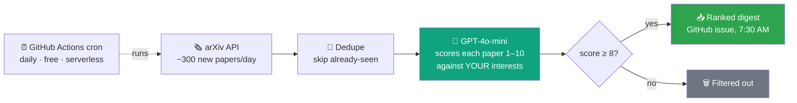

<div align="center">

# 📡 arXiv Radar

**Your personal AI research assistant — reads hundreds of arXiv papers every day,<br>hands you only the ones that matter.**

[](https://github.com/Bhanubathini2002/arxiv-radar/actions/workflows/digest.yml)
[](arxiv_radar.py)
[](https://platform.openai.com)
[](#-cost)
[](LICENSE)

📥 [**Read today's digest →**](../../issues?q=is%3Aissue+label%3Adigest+sort%3Acreated-desc)

</div>

---

## 🤔 The problem

arXiv publishes **300–500 new AI papers every single day**. Reading even the titles takes an hour. So you either drown in the firehose... or miss the paper that would have saved your project a month.

## 💡 The fix

A bot that reads *everything* and wakes you up with only the good stuff:



Every morning: **open the [Issues tab](../../issues) → read 10 papers instead of 300 → done in 5 minutes.** ☕

<details>
<summary>📄 <b>Click to see what a digest entry looks like</b></summary>
<br>

> ### [DynaKRAG: A Unified Framework for Learnable Evidence Control in Multi-Hop RAG](https://arxiv.org/abs/2607.06507)
> **Score 10/10** · `cs.IR`
>
> > Directly addresses RAG with a focus on evidence control and multi-hop retrieval strategies.
>
> <details><summary>Abstract</summary>Multi-hop retrieval-augmented generation (RAG) acquires evidence sequentially, with each new document potentially revealing missing facts, bridge entities, query defects...</details>

Real numbers from day one: **296 papers scanned → 38 surfaced → top 10 were genuine must-reads.**

</details>

---

## ⚡ Setup — 5 minutes, then never again

You need: a GitHub account · the [`gh` CLI](https://cli.github.com/) · an [OpenAI API key](https://platform.openai.com/api-keys)

```bash
# 1️⃣  Get the code
git clone https://github.com/Bhanubathini2002/arxiv-radar && cd arxiv-radar

# 2️⃣  Store your OpenAI key as an encrypted secret
gh secret set OPENAI_API_KEY

# 3️⃣  Create the digest label
gh label create digest --color 1D76DB

# 4️⃣  Fire a test run 🚀
gh workflow run "arXiv digest"
```

Check the **Issues** tab a few minutes later — your first digest is waiting. From now on it runs itself, every day, even with your laptop off.

<details>
<summary>💻 <b>Prefer to run it locally?</b></summary>

```bash
pip install -r requirements.txt
export OPENAI_API_KEY=sk-...        # PowerShell: $env:OPENAI_API_KEY="sk-..."
python arxiv_radar.py
```
</details>

---

## 🎛️ Make it yours

Everything personal lives in **one file** — [`config.yaml`](config.yaml). Describe your interests in plain English; that text *is* the LLM's rubric:

```yaml
categories:          # 🗂️ WHERE to look
  - cs.CL            #    NLP & language models
  - cs.IR            #    information retrieval
  - cs.CV            #    computer vision

interests: |         # 🎯 WHAT to look for — just write it out
  I am building a production RAG chat application...
  - RAG architectures: chunking, reranking, multi-hop retrieval
  - RAG evaluation: faithfulness metrics, hallucination detection
  - Guardrails: prompt injection defense, jailbreak detection

min_score: 8         # 🔊 volume dial
model: gpt-4o-mini   # 🤖 any cheap model works
```

| 🎛️ Knob | What it does |
|---|---|
| `categories` | arXiv sections to scan — [full taxonomy](https://arxiv.org/category_taxonomy) |
| `interests` | Your research profile, plain English. More specific = sharper filter |
| `min_score` | `9` ≈ 5–10 must-reads/day · `8` ≈ 10–20 · `7` = firehose 🌊 |
| `model` | Any OpenAI chat model — the task is easy, cheap is fine |
| cron in [`digest.yml`](.github/workflows/digest.yml) | Delivery time — currently 12:30 UTC = 7:30 AM US Central |

Edit → commit → push. Next run picks it up. **Nothing to redeploy, because nothing is deployed.**

---

## 💸 Cost

| | |
|---|---|
| 🤖 LLM scoring (~300 papers/day) | **$0.50 – $1.50 / month** |
| ☁️ Compute (GitHub Actions, public repo) | **$0** |
| 🖥️ Servers to maintain | **0** |

<details>
<summary>🔍 <b>How it stays cheap & reliable</b></summary>
<br>

- 🧾 **Pay once per paper** — scored IDs are remembered in `data/seen.json` (committed back by the bot), so no paper is ever billed twice
- 🐍 **No frameworks** — the whole pipeline is one ~200-line Python script, stdlib + `pyyaml`
- 🤝 **Polite to arXiv** — requests spaced 3+ seconds per their [API guidelines](https://info.arxiv.org/help/api/tou.html)
- 🛡️ **Self-healing** — automatic retry with backoff on rate limits; a failed batch is logged and skipped, never fatal

</details>

---

<div align="center">

**MIT licensed** — fork it, point it at *your* research interests, wake up smarter. 🌅

</div>
